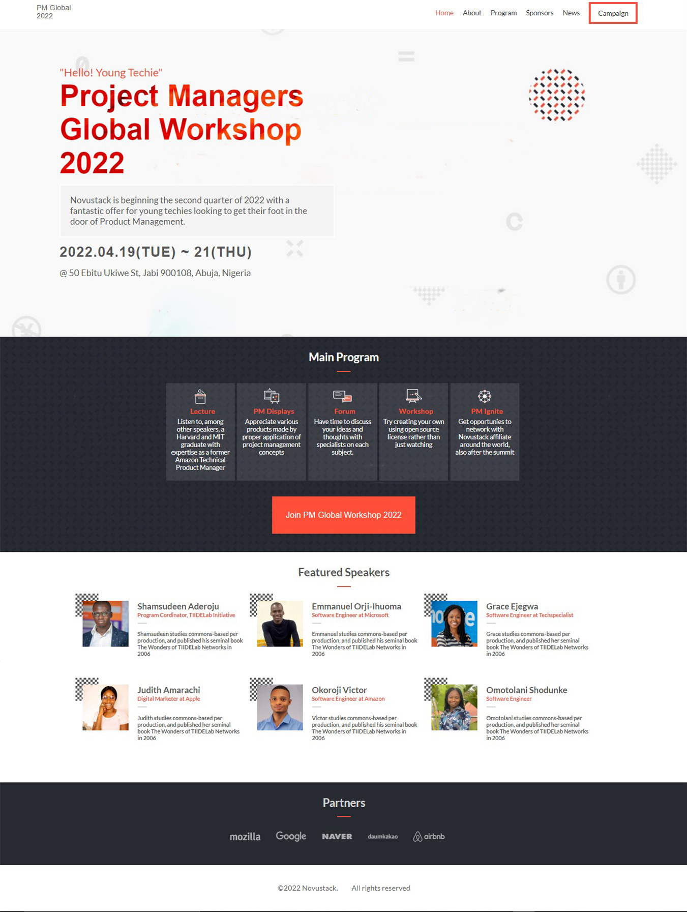
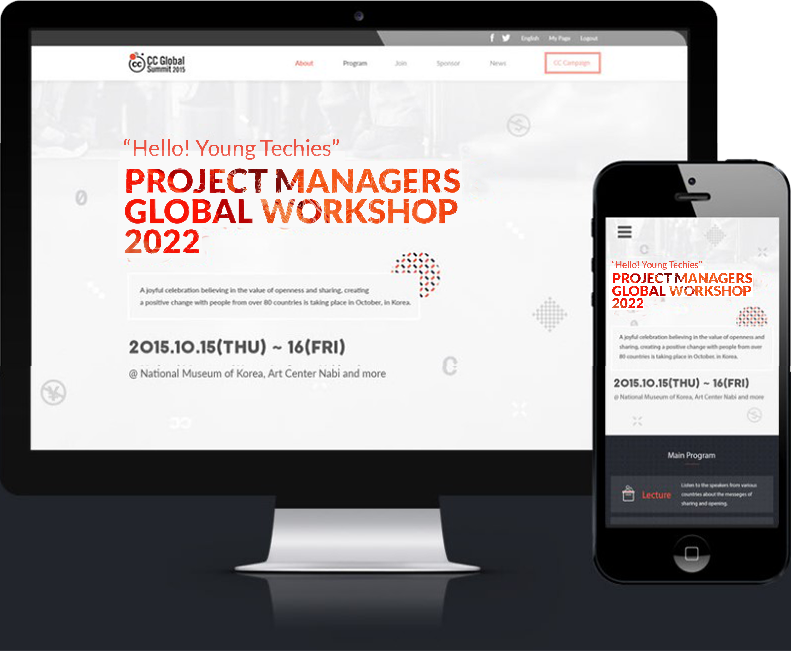

# Project Managers' Global Workshop

This project is focused on building an conference website showing detailed description of an upcoming submit event titled "Tech them young."

 

This project is an website for a Project Managers' Global workshop by Novustack.
It shows pertinent information about the workshop, including the program, speakers, sponsors, and contact information. A Gallery from past workshops is displayed also.

The development follows a mobile-first approach so you're sure to still have a good feel of the website on mobile devices. The home and about pages only are contained.

## Built With

- HTML5
- CSS3
- Javascript

## Live Demo

[Live Demo Link](https://emmiiorji.github.io/project-mgt-workshop/)

## Getting Started

To get a local copy up and running follow these simple example steps.

## Prerequisites

- A modern browser e.g [Google Chrome](https://www.google.com/chrome/)
- Have git installed.[Link to download git](https://git-scm.com/downloads)

## Setup

- git clone https://github.com/emmiiorji/project-mgt-workshop.git
- cd project-mgt-workshop/
- Run the index.html file on a browser or host the folder on a server

## Deployment

- Deploy on any web server
- For more information about publishing sources, see [About github pages](https://pages.github.com/)

## Author

👤 **Emmanuel Orji-Ihuoma**

- Twitter: [@emmiiorji](https://twitter.com/emmiiorji)
- LinkedIn: [LinkedIn](https://linkedin.com/in/emmanuel-orji-2a8317121)
- GitHub: [@githubhandle](https://github.com/emmiiickymarz)

## 🤝 Contributing

Contributions, issues, and feature requests are welcome!

Feel free to check the [issues page](../../issues/).

## Show your support

Give a ⭐️ if you like this project!

## Acknowledgments

- Design inspired by [Cindy Shin on Behance](https://www.behance.net/gallery/29845175/CC-Global-Summit-2015)
- Microverse
- Coding Partners
- Code Reviewers

## 📝 License

This project is [MIT](./MIT.md) licensed.
